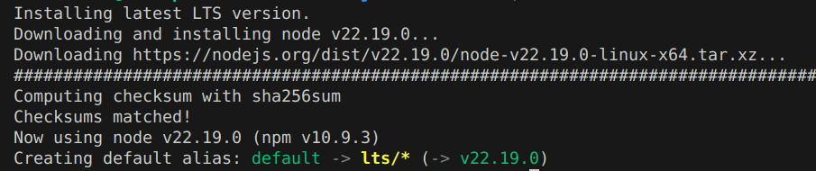

# StrideHub
Performance Review Portal

##Decisions Made
Sept 16th
1. For the front end going to use React and backend only be Django app
2. To make it easy for django to send data to the frontend, switching to DRF called Django REST framework(instead od Django tempaltes of how we usually built other apps/projects) so that its easy for react to communicate with backend directly with API endpoints provided by Django - we are basically decoupling the two systems
3. So here React will be running in a different server and django in different server - so to enable communication set up CORS headers config in settings - this allows react app to send request to django server as both will be running in different ports or servers(it seems wihtout this browser will block that connection for security reasons)
CORS_ALLOW_ALL_ORIGINS = True
4. Installing NVM - node version manager that helps to swirch and manage differnet node versions

