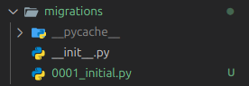

# StrideHub
Performance Review Portal

##Decisions Made
Sept 16th
1. For the front end going to use React and backend only be Django app
2. To make it easy for django to send data to the frontend, switching to DRF called Django REST framework(instead od Django tempaltes of how we usually built other apps/projects) so that its easy for react to communicate with backend directly with API endpoints provided by Django - we are basically decoupling the two systems
3. So here React will be running in a different server and django in different server - so to enable communication set up CORS headers config in settings - this allows react app to send request to django server as both will be running in different ports or servers(it seems wihtout this browser will block that connection for security reasons)
CORS_ALLOW_ALL_ORIGINS = True
4. Installing NVM - node version manager that helps to swirch and manage differnet node versions

Note:
Node Version: v22.19.0
NPM version: v10.9.3
NVM Version: 0.39.7

### Sept 26th - Evening code session
Created the model in models.py(basically a schema -kind of blueprint)
Some concepts to remember:
    we define the data model in the python file and djanfo automatically created, translates it into database tables
    here is the catch - everytime we update the models.py we need commit, tell django to make the changes in the database using makemigrations(compares current state and old files and update the model in the database)
    

    Here we have 2 things:
    makemigrations - that checks all the changes comparing old and new files
    migrate - this will apply the pending migrations in the database

    This way we can track, manage, develop with the schema evoluation

Enables the django - simplejwt in the installed apps
This bascially provides token when we authenticate - its part of rest framework - DRF
JWT helps to handle sessiosn in the client side as it contains all the information. This token will be sent in all API request to the server to get the response
Note: from readings - JWT creates 2 tokens - access token(short lived) and refresh token(long lived)
(using gemini and gpt to learn all the concepts and reading on the topics - its really helpful)

